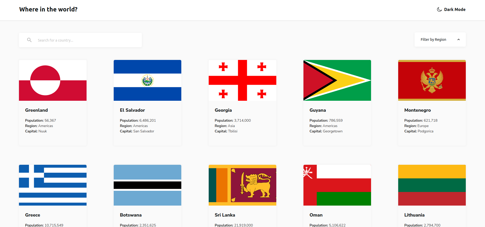

#  REST Countries API with Vue, Vuex, Tailwind CSS and Composition API

This is a solution test  solution requested.

## Table of contents

- [Overview](#overview)
  - [The challenge](#the-challenge)
  - [Screenshot](#screenshot)
  - [Links](#links)
- [My process](#my-process)
  - [Built with](#built-with)
- [Run Project](#how-to-run-project)

## Overview

### The Task

Users should be able to:

- See all countries from the API on the homepage
- Search for a country using an `input` field
- Filter countries by region
- Click on a country to see more detailed information on a separate page
- Click through to the border countries on the detail page
- Toggle the color scheme between light and dark mode *(optional)*

### Screenshot



### Links

- Live Site URL: [Live](https://symphonious-croquembouche-ca30a5.netlify.app/)

## My process

### Built with

- HTML 5
- [TailwindCSS](https://tailwindcss.com/) - CSS Framework
- Mobile-first workflow
- [Vue.js](https://vuejs.org/) - front-end framework Vue3 | Composition API
- [Vuex](https://vuex.vuejs.org/) - Vue  state management library

## Project Setup

```sh
npm install
```

### Compile and Hot-Reload for Development

```sh
npm run dev
```

### Compile and Minify for Production

```sh
npm run build
```

### Still to add more of testing
